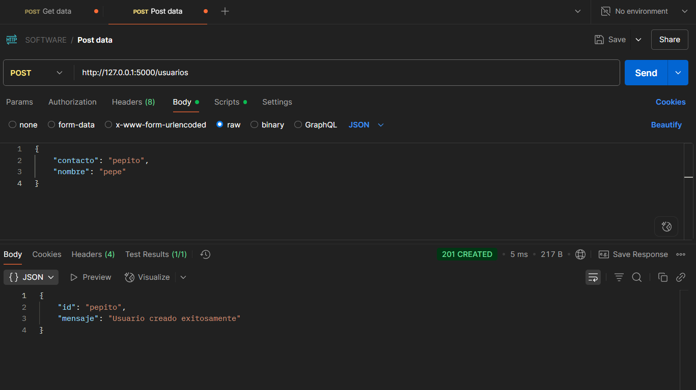
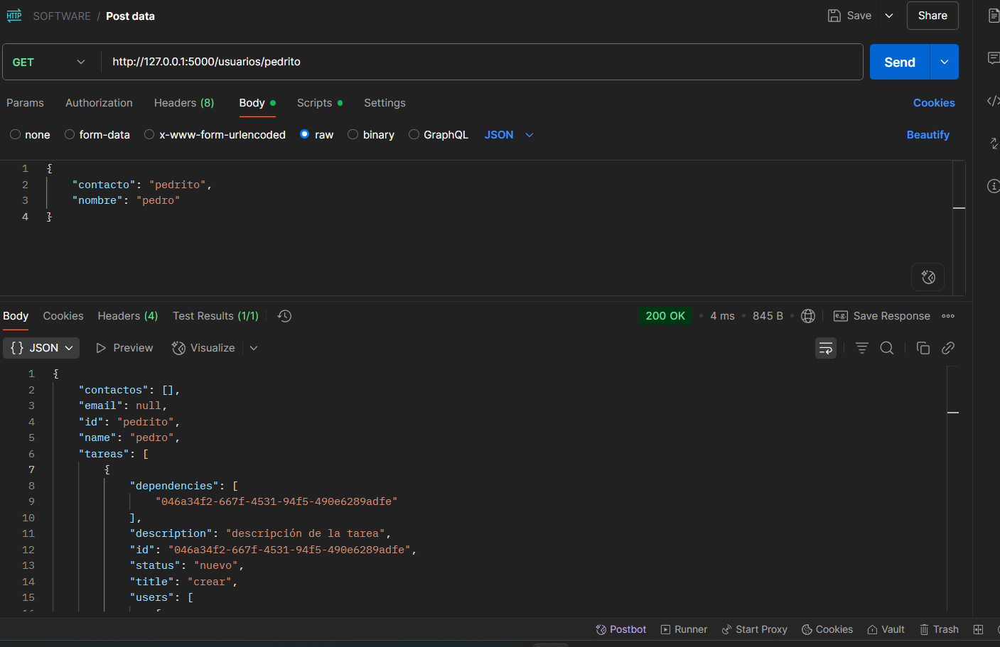
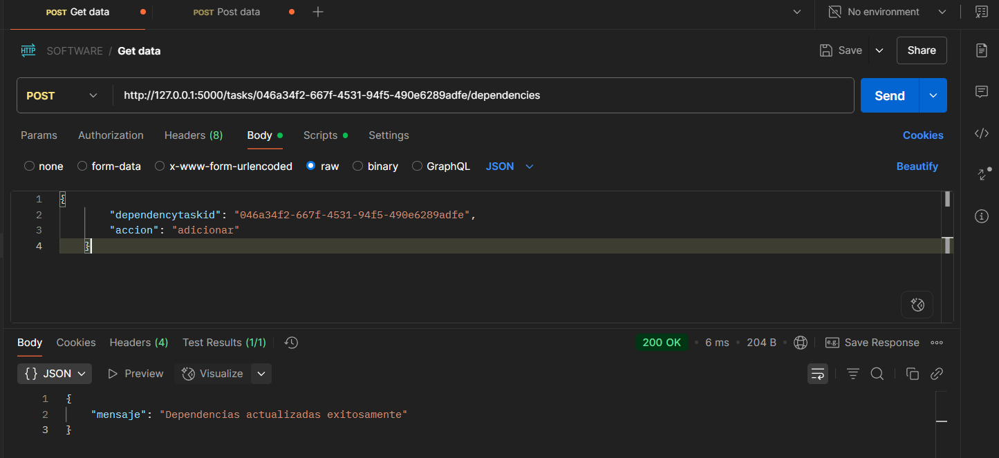
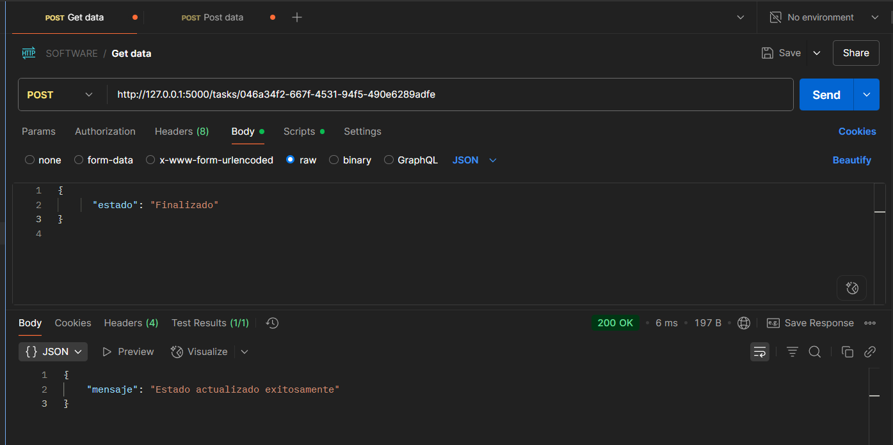
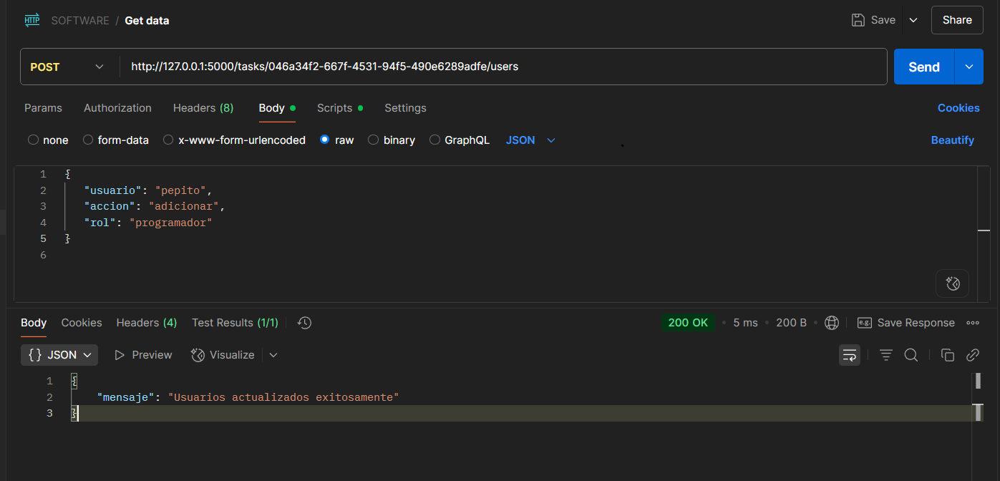

# Task System Application

## Overview
This project is a simple task management system that allows users to create, assign, and manage tasks. It is designed to be easy to use and extend, making it suitable for personal or small team use.

## Project Structure
```
task-system-app
├── src
│   ├── __init__.py
│   ├── controller.py
│   ├── data_handler.py
│   ├── models
│   │   ├── __init__.py
│   │   ├── usuario.py
│   │   ├── tarea.py
│   │   └── asignacion.py
│   └── utils
│       └── __init__.py
├── requirements.txt
└── README.md
```

## Installation
1. Clone the repository:
   ```
   git clone <repository-url>
   ```
2. Navigate to the project directory:
   ```
   cd task-system-app
   ```
3. Install the required dependencies:
   ```
   pip install -r requirements.txt
   ```

## Usage
To run the application, you can create a main script that utilizes the `TaskController` class from `controller.py`. Here is a simple example:

```python
python src/controller.py
```

## 📸 Capturas de Pantalla

### Crear usuarios


### Obtener detalles


### Dependencia


### Cambiar estado


### Asignar



## Contributing
Contributions are welcome! Please feel free to submit a pull request or open an issue for any suggestions or improvements.

## License
This project is licensed under the MIT License. See the LICENSE file for more details.
